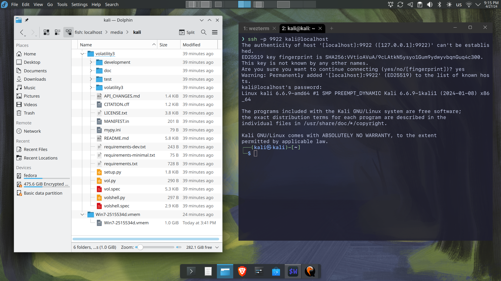
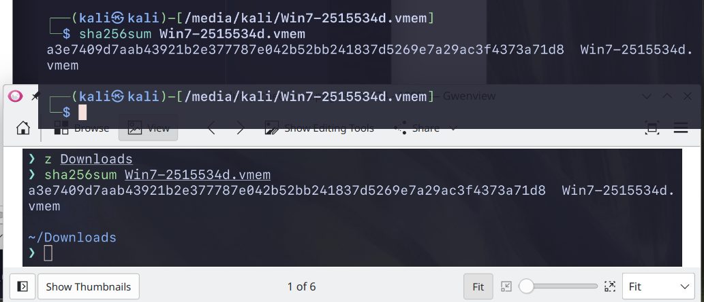
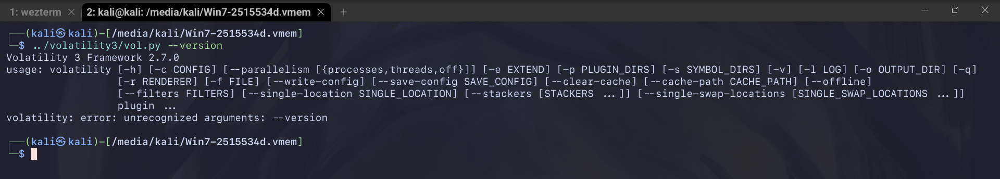
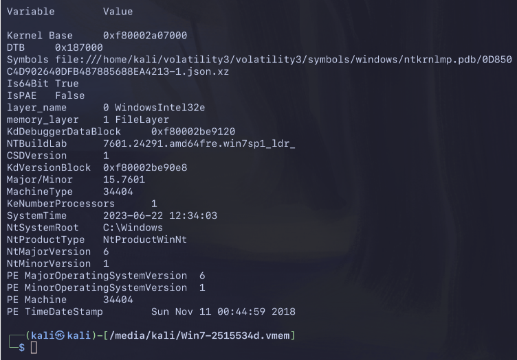

# Report

00. dump checksum


```bash
sha256sum Win7-2515534d.vmem
a3e7409d7aab43921b2e377787e042b52bb241837d5269e7a29ac3f4373a71d8  Win7-2515534d.vmem
```

01. clonning Volatility3


02. preparing dump isolation
```bash
mkisofs -output-charset utf-8 -o Win7-2515534d.vmem.iso Win7-2515534d.vmem
mkisofs -output-charset utf-8 -o volatility3.iso volatility3
```

03. running VM with mounted ISOs and ports passthrough
```bash
qemu-system-x86_64 -enable-kvm -smp 2 -m 4G -bios /usr/share/edk2/ovmf/OVMF_CODE.fd -drive file=kali-linux-2024.1-live-amd64.iso,format=raw,index=0,media=cdrom -drive file=Win7-2515534d.vmem.iso,format=raw,index=1,media=cdrom -drive file=volatility3.iso,format=raw,index=2,media=cdrom -nic hostfwd=tcp:127.0.0.1:9922-0.0.0.0:22,hostfwd=tcp:127.0.0.1:9980-0.0.0.0:80
```

04. boot Kali in forensic mode


05. dump and volatility mounted in VM read only


06. installing ssh to control from host and to exchange files


07. host's file manager and terminal are connected


08. comparing checksum with initially checked - **THE SAME!!**


09. run Volatility


10. OS INFO

```bash
 ~/volatility3/vol.py -f Win7-2515534d.vmem windows.info
```


```
Variable        Value

Kernel Base     0xf80002a07000
DTB     0x187000
Symbols file:///home/kali/volatility3/volatility3/symbols/windows/ntkrnlmp.pdb/0D850C4D902640DFB487885688EA4213-1.json.xz
Is64Bit True
IsPAE   False
layer_name      0 WindowsIntel32e
memory_layer    1 FileLayer
KdDebuggerDataBlock     0xf80002be9120
NTBuildLab      7601.24291.amd64fre.win7sp1_ldr_
CSDVersion      1
KdVersionBlock  0xf80002be90e8
Major/Minor     15.7601
MachineType     34404
KeNumberProcessors      1
SystemTime      2023-06-22 12:34:03
NtSystemRoot    C:\Windows
NtProductType   NtProductWinNt
NtMajorVersion  6
NtMinorVersion  1
PE MajorOperatingSystemVersion  6
PE MinorOperatingSystemVersion  1
PE Machine      34404
PE TimeDateStamp        Sun Nov 11 00:44:59 2018
```

11. OUTPUTS

[outputs](./outputs)
