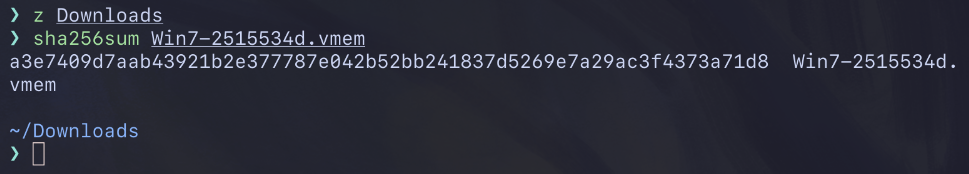
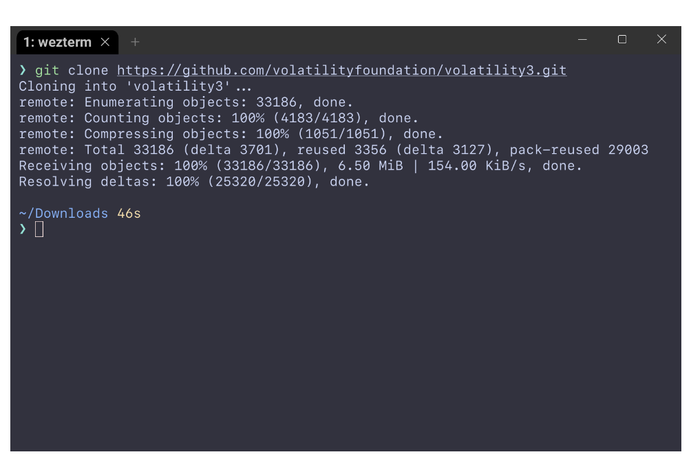
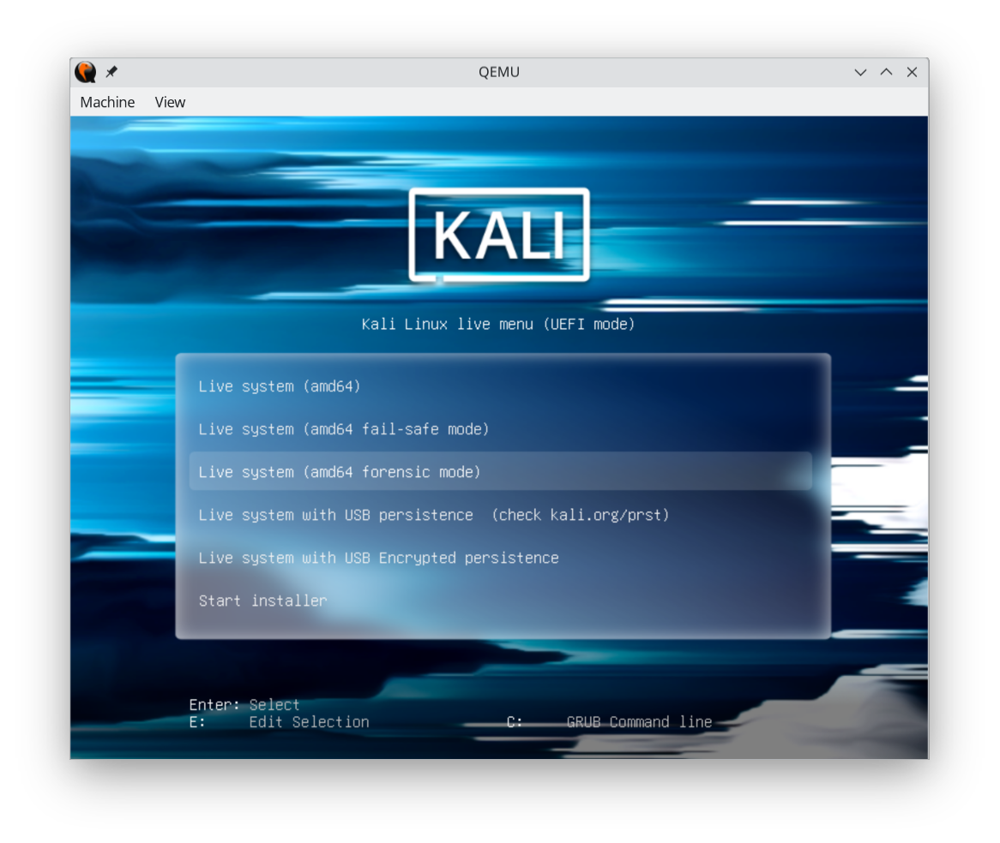
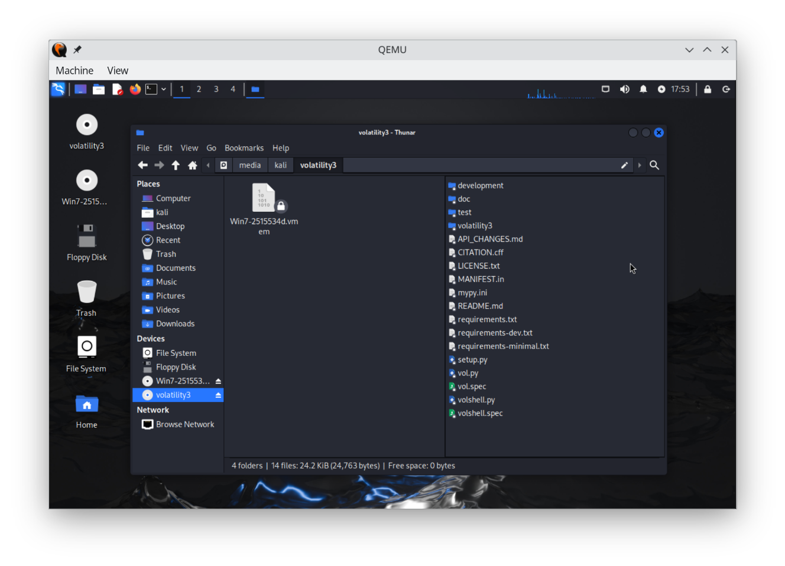

# Report

00. dump checksum


```bash
sha256sum Win7-2515534d.vmem
a3e7409d7aab43921b2e377787e042b52bb241837d5269e7a29ac3f4373a71d8  Win7-2515534d.vmem
```

01. preparing dump isolation
```bash
mkisofs -output-charset utf-8 -o Win7-2515534d.vmem.iso Win7-2515534d.vmem
mkisofs -output-charset utf-8 -o volatility3.iso volatility3
```

02. clonning Volatility3


03. running VM with mounted ISOs and ports passthrough
```bash
qemu-system-x86_64 -enable-kvm -smp 2 -m 4G -bios /usr/share/edk2/ovmf/OVMF_CODE.fd -drive file=kali-linux-2024.1-live-amd64.iso,format=raw,index=0,media=cdrom -drive file=Win7-2515534d.vmem.iso,format=raw,index=1,media=cdrom -drive file=volatility3.iso,format=raw,index=2,media=cdrom -nic hostfwd=tcp:127.0.0.1:9922-0.0.0.0:22,hostfwd=tcp:127.0.0.1:9980-0.0.0.0:80
```

04. boot Kali in forensic mode


05. dump and volatility mounted in VM read only
```bash

```
