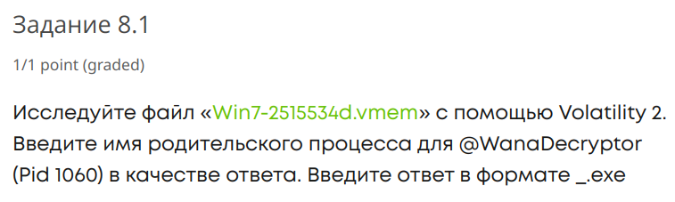
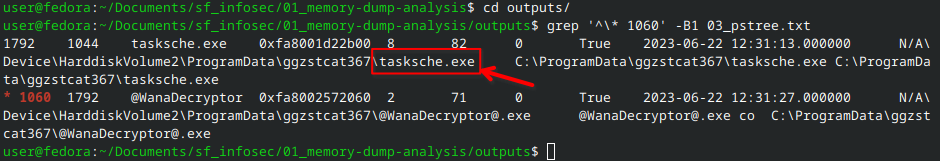
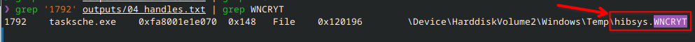

# Memory dump analysis report

As part of SF InfoSec courses homework assessment

## Preparing the environment

00. dump checksum


```bash
sha256sum Win7-2515534d.vmem
```
> a3e7409d7aab43921b2e377787e042b52bb241837d5269e7a29ac3f4373a71d8  Win7-2515534d.vmem

01. clonning Volatility3


02. preparing dump isolation
```bash
mkisofs -output-charset utf-8 -o Win7-2515534d.vmem.iso Win7-2515534d.vmem
mkisofs -output-charset utf-8 -o volatility3.iso volatility3
```

03. running VM with mounted ISOs and ports passthrough
```bash
qemu-system-x86_64 -enable-kvm -smp 2 -m 4G -bios /usr/share/edk2/ovmf/OVMF_CODE.fd -drive file=kali-linux-2024.1-live-amd64.iso,format=raw,index=0,media=cdrom -drive file=Win7-2515534d.vmem.iso,format=raw,index=1,media=cdrom -drive file=volatility3.iso,format=raw,index=2,media=cdrom -nic hostfwd=tcp:127.0.0.1:9922-0.0.0.0:22,hostfwd=tcp:127.0.0.1:9980-0.0.0.0:80
```

04. boot Kali in forensic mode


05. dump and volatility mounted in VM read only (copied Volatility to $HOME later)


06. installing ssh to control from host and to exchange files


07. host's file manager and terminal are connected


08. comparing checksum with initially checked - **THE SAME!!**


09. run Volatility


## Riddles and answers

### Scanning with Volatility V3

At first I was generating outputs of some commonly used commands, like this:

```python
#!/usr/bin/python3

from subprocess import run, PIPE

commands = [
        "info",
        "pslist",
        "psscan",
        "pstree",
        "handles",
        "dlllist",
        "netstat",
        "netscan",
        "filescan",
        "registry.printkey",
        "hivescan",
        "hivelist",
        "cmdline",
        "malfind",
        ]

for i, command in enumerate(commands):
    print(f"\n\n{i:02} Running {command}")
    result = run([
                  "/home/kali/volatility3/vol.py",
                   "-f", "/media/kali/Win7-2515534d.vmem/Win7-2515534d.vmem",
                   f"windows.{command}",
                  ],
                 stdout=PIPE,
                 text=True,
                 )
    with open(f"/home/kali/Documents/{i:02d}_{command}.txt", "w") as f:
        f.write(result.stdout)
```

[outputs](./outputs)

### Final: answering

#### 8.1





#### 8.2




#### 8.3


As I didn't find PID in Volatility3 dlllist, I just used Volatility2:
```bash
python2.7 ~/volatility/vol.py --profile=Win7SP1x64 -f /media/kali/Win7-2515534d.vmem/Win7-2515534d.vmem dlllist | less
```

And here it is:


[Volatility v2 dll list](outputs/05_dlllist_v2.txt)

And, finally, let's check one more time that sha256 sum is still the same:


- [x] is the same